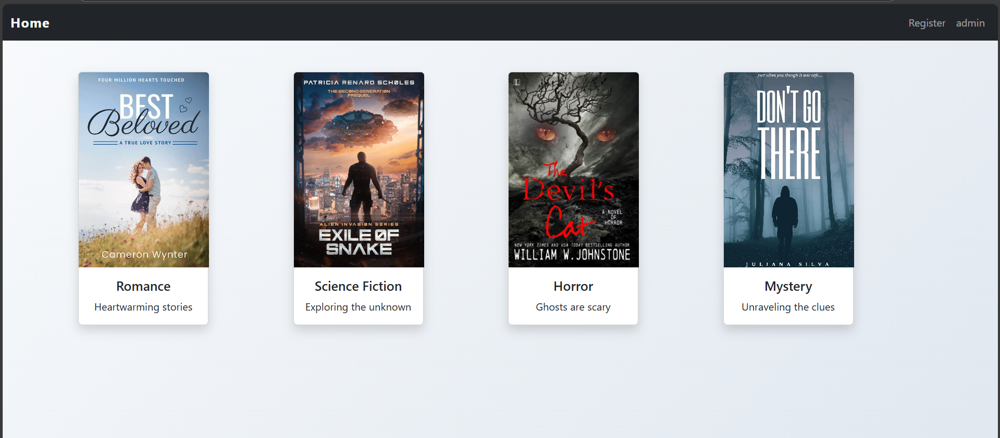

# Django Genre Collection App

## Overview
Django Genre Collection App is a web application for exploring genre-based media collections. Built with Django and Bootstrap, it offers a responsive, user-friendly interface for browsing collections, viewing detailed pieces, and registering accounts, all styled with a sleek dark theme.

## Features
- **Collection Browsing**: Explore genre-organized collections in a 4-column card layout with poster-style covers.
- **Detailed Views**: Dive into individual pieces with cards showing titles, artists, years, and covers.
- **User Registration**: Simple, validated registration form with Bootstrap styling.
- **Responsive Design**: Seamless experience across devices using Bootstrap 5.

## Screenshot

A screenshot of the homepage showcasing the collections grid, hover effects, and responsive layout.

## Technologies Used
- **Backend**: Django 5.2.1
- **Frontend**: HTML5, CSS3, Bootstrap 5
- **Database**: SQLite (default Django setup)
- **Python**: 3.13.1

## Getting Started
To set up and run the project locally:

1. Clone the repository:
   ```bash
   git clone <repository-url>
   cd <repository-directory>
   ```

2. Create a virtual environment:
   ```bash
   python -m venv venv
   source venv/bin/activate  # On Windows: venv\\Scripts\\activate
   ```

3. Install dependencies:
   ```bash
   pip install -r requirements.txt
   ```

4. Run migrations:
   ```bash
   python manage.py makemigrations
   python manage.py migrate
   ```

5. Create a superuser (optional, for admin access):
   ```bash
   python manage.py createsuperuser
   ```

6. Start the development server:
   ```bash
   python manage.py runserver
   ```

7. Visit the app:
   Open your browser to [http://127.0.0.1:8000/genre/](http://127.0.0.1:8000/genre/).

## Project Structure

### Models
- **Collection**
  - `collection_name`: Name of the collection.
  - `collectionCover`: Cover image URL/path.
  - `description`: Collection description.
- **Piece**
  - `title`: Title of the piece.
  - `artist`: Artist name.
  - `typ`: Type/genre of the piece.
  - `year`: Release year.
  - `pieceCover`: Cover image URL/path.
  - `collection`: Foreign key to Collection.

### URL Patterns
- `/genre/` - Home page showing all collections.
- `/genre/register/` - User registration page.